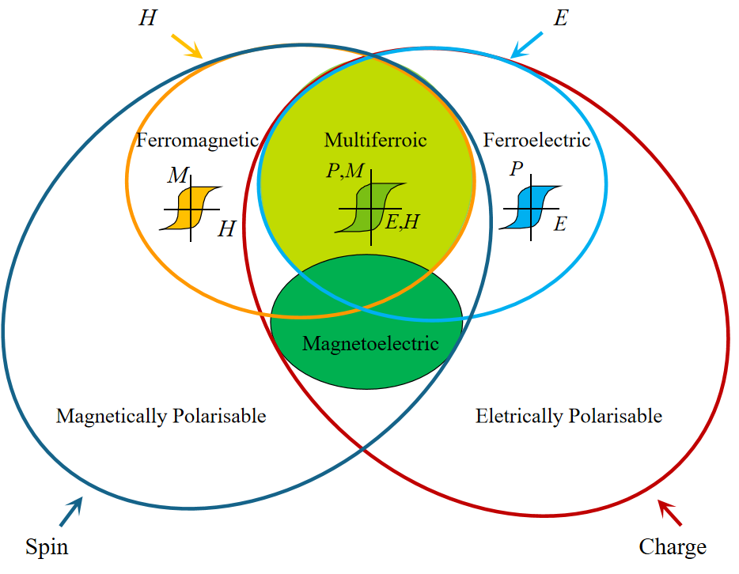
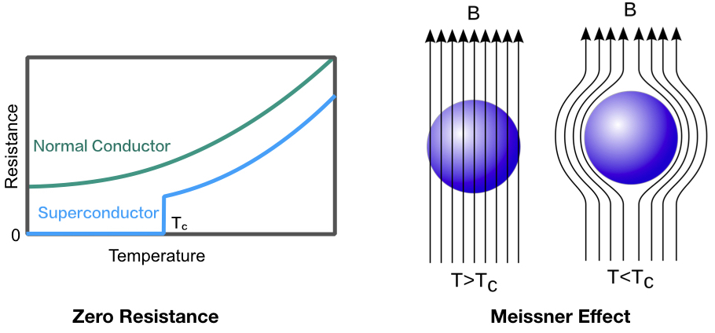
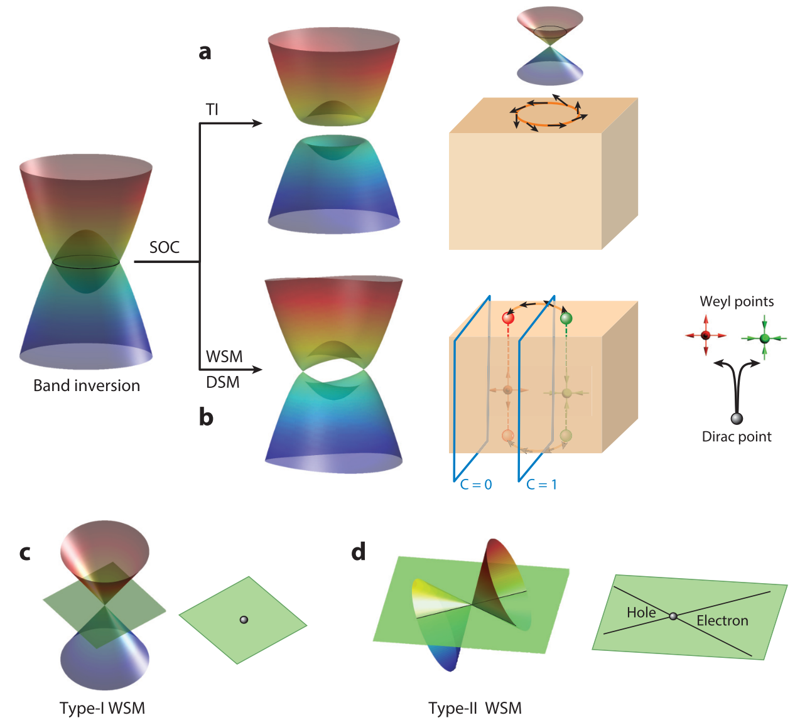

# Welcome to Low Temperature Physics Lab!

## News

## What we do

We focus on the the quantum phenomenon of strongly correlated materials under extreme conditions(low temperatures approaching absolute zero degree, strong magnetic fields up to 14 T and high pressure, etc.) by means of electrical and thermal transport, dielectric constant, thermal-expansion, magnetostriction, specific heat, magnetization and point-contact spectroscopy. Current ongoing research covers the following topics:

### Multiferroic and Magnetoelectric Materials

Certain materials exhibit two or more ferroic orders simutaneously, e.g. ferromagnetism, ferroelectricity, and ferroelasticity. The magnetic and ferroelectric properties and their coupling effects are investigated by various imaging techniques, such as dielectric constant, ferroelectricity, magnetization, magnetoelectric coefficient etc.

{: style="height:270px;width:347px"}

### Superconductors

In contrast to normal conductors carrying resistance, a superconductor looses its resistance completely below a certain critical temperature Tc. Additionally, a superconductor expels magnetic flux from its interior and shows perfect diamagnetism , which is called the Meissner Effect. Such a a macroscopic quantum phenomenon is called superconductivity. Very recently, near room temperature superconductor has been found under extremely high pressure by Drozdov, A. P. et al. [Nature 569, 528–531 (2019)](https://www.nature.com/articles/s41586-019-1201-8).

{: style="height:270px;width:579.6px"}

### Topological materials

Weyl and Dirac semimetals are three-dimensional phases of matter with gapless electronic excitations that are protected by topology and symmetry. As three-dimensional analogs of graphene, they have generated much recent interest. Deep connections exist with particle physics models of relativistic chiral fermions, and, despite their gaplessness, to solid-state topological and Chern insulators. Their characteristic electronic properties lead to protected surface states and novel responses to applied electric and magnetic fields.

{: style="height:405px;width:444px"}

Figure adapted from [Binghai Yan and Claudia Felser, Annual Review of Condensed Matter Physics 8 337 (2017)](https://www.annualreviews.org/doi/10.1146/annurev-conmatphys-031016-025458)

## Contact us

If you are interested in our activities, feel free to contact us @ [mingquan.he@cqu.edu.cn](mingquan.he@cqu.edu.cn)
